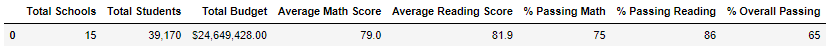

# School District Analysis

## Overview
This analysis serves to compare schools within a district based on math and reading scores, as well as relating the success of their respective students to school size, school type, and spending per capita.  After the original analysis, it was found that there were reporting discrepancies for a single grade at a single school, so the analysis was re-run with cleaner data.

## Results
### District Analysis
After removing the scores for the 9th graders at Thomas High School, the overall passing percentage for the district went down only 0.1%.

#### Old

#### New

### School Summary
In the revised analysis, Thomas High School's scores are affected significantly.  The % Passing Math score dropped from 97.3% to 93.2% and the % Passing Reading Score rose to 97.0% from 90.6%.  The Overall Passing % remained relatively stable - moving only three basis points from 90.9% to 90.6%

#### Old

#### New

### Top 5 Schools
Though the new analysis changed Thomas High School's metrics, it maintains the second highest Overall Passing % in the district.

#### Old

#### New

### Scores By Grade
When displaying reading and math scores by grade, we can see that the data for the 9th grade at Thomas High School is NaN - removed from the analysis.

#### Reading Scores by Grade
##### Old

##### New

#### Math Scores By Grade
##### Old

##### New

### Scores by Per Student Spending
Interestingly, spending per student has an inverse effect on overall passing percentage.  The schools at the lowest end of the spending per student range in both analyses were the most successful.

#### Old

#### New

### Scores by Size
In both analyses, the Medium sized schools had the highest % Overall Passing.
#### Old

#### New

### Scores by Type
Charter schools in both analyses are significantly more successful than District schools - they maintain a 90% Overall Passing in both analyses compared to the District Schools' 54%

#### Old

#### New

## Summary
Though there was a slight change in scores and percentages for Thomas High School, it does not have a significant effect on the district-wide analysis.  Average scores went down, but only by tenths of percentage points.  The overall analysis, however, does seem to indicate a striking disparity between student success at Charter vs District schools which warrants further research.  Additionally, follow up is needed at Thomas High School to ensure that future reporting is honest and accurate.
