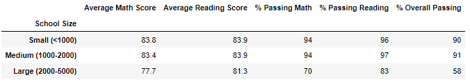

# School District Analysis

## Overview
This analysis serves to compare schools within a district based on math and reading scores, as well as relating the success of their respective students to school size, school type, and spending per capita.  After the original analysis, it was found that there were reporting discrepancies for a single grade at a single school, so the analysis was re-run with cleaner data.

## Results
### District Analysis
#### Old

#### New

### School Summary
#### Old

#### New

### Top 5 Schools
#### Old

#### New

### Reading Scores By Grade
#### Old

#### New

### Math Scores By Grade
#### Old

#### New

### Scores by Per Student Spending
#### Old

#### New

### Scores by Size
#### Old

#### New

### Scores by Type
#### Old

#### New

## Summary
